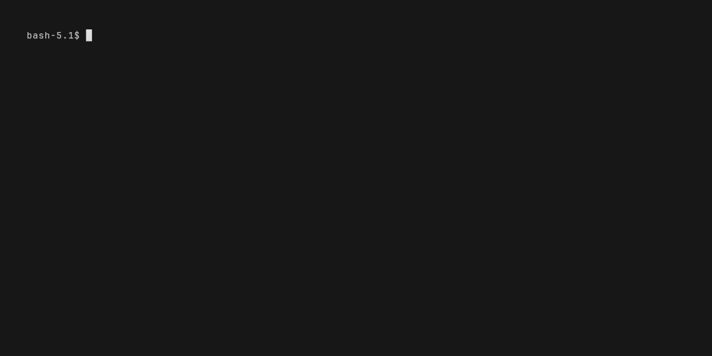

# Go-PWR Application



Please visit us at [RocketPowerInc.com](https://rocketdashboard.notion.site/Welcome-to-RocketPowerInc-1a1627bc6fd8805ab693f164a1b3ceda)

## ✨ Overview

**`go-pwr`** is a cross-platform launcher for your personal automation scripts. Built with Go and powered by [Charm's](https://github.com/charmbracelet) [Bubble Tea framework](https://github.com/charmbracelet/bubbletea), it delivers a sleek, interactive TUI for browsing, previewing, and running bash and powershell scripts across Windows, macOS, Linux, and server environments.

Features beautiful syntax highlighting for script previews (when `bat` is installed), tag-based script search functionality. It automatically clones the "scriptbin" repository to `$HOME/Downloads/Temp/scriptbin`, providing a centralized location for script access and management that's easily accessible and always up to date with the latest scripts.

---

## 📥 Quick Start

Choose your platform for detailed installation instructions:

- **[🪟 Windows](Windows-Bootstrap.md)** - Complete Windows installation guide
- **[🍎 macOS](MacOS-Bootstrap.md)** - Complete macOS installation guide
- **[🐧 Linux](Linux-Bootstrap.md)** - Complete Linux installation guide

---

## � Dependencies

**`go-pwr`** requires the following tools for optimal functionality:

### Required

- **Go 1.19+** - For installation via `go install`
- **Git** - For repository operations and cloning

### Platform-Specific

- **Windows**: PowerShell 7+ (`pwsh`) - For running .ps1 scripts
- **macOS**: Bash (built-in) - For running shell scripts
- **Linux**: Bash (built-in), tmux (recommended) - For script execution

### Optional (Enhanced Experience)

- **`bat`** - For syntax highlighting in script previews
- **`glow`** - For rendering markdown documentation
- **`gum`** - For enhanced interactive elements

See the platform-specific bootstrap guides for detailed installation instructions.

---

## 🔧 Repository Setup

**`go-pwr`** uses RocketPowerInc's scriptbin by default, but you can configure it to use your own custom script repository while keeping the default as a fallback option.

**Quick Commands:**

- `-h`, `-help` - Show help message with all available flags
- `-v`, `-version` - Show version information and build details
  - FYI the "Git commit" and the "Build date" fields will only show if the app is built from source (Very good for when I and developing the app)
- View current repository: `go-pwr -show-repo`
- Set custom repository: `go-pwr -set-repo https://github.com/yourusername/your-scripts.git`
- Reset to default: `go-pwr -reset-repo`

For detailed setup instructions, repository requirements, and troubleshooting, see **[Repository Setup Guide](REPOSITORY_SETUP.md)**.

---

## 🔍 Tag-Based Search

**`go-pwr`** includes powerful tag-based search functionality to help you quickly find the right scripts for your needs. Scripts can be tagged with:

**Usage:**

- Press `Ctrl+F` to activate search mode
- Type multiple tags separated by spaces (e.g., `bash linux ubuntu`)
- Search results update in real-time as you type
- Press `Enter` to apply search or `Escape` to cancel
- Press `Escape` again to clear search and show all scripts

## 🏷️ Tagging Your Scripts

To make your scripts searchable, add tags at the top of your script files using this format:

### Bash/Shell Scripts (.sh)

```bash
#!/usr/bin/env bash
set -euo pipefail

#*Tags:
# Languages: bash zsh
# Platforms: Linux Mac WSL
# Distros: Ubuntu Debian
# Categories: utility development
# PackageManagers: apt brew
# Privilege: Admin User

# Your script content here...
```

### PowerShell Scripts (.ps1)

```powershell
#! Description: Your script description

#*Tags:
# Languages: pwsh powershell
# Platforms: Windows
# Categories: utility demo
# PackageManagers: winget chocolatey
# Privilege: Admin User

# Your script content here...
```

**Tagging Guidelines:**

- Start the tags section with `#*Tags:` on its own line
- Each category starts with `# CategoryName:` followed by space-separated tags
- Use lowercase for consistency (parser handles case-insensitivity)
- Common categories: `Languages`, `Platforms`, `Distros`, `Categories`, `PackageManagers`, `DesktopEnvironments`, `Architectures`
- Add as many or as few tags as appropriate for your script

## 🔄 Recursive vs Directory Mode

**`go-pwr`** supports two viewing modes:

- **Directory Mode** (default): Browse scripts folder by folder, just like a file manager
- **Recursive Mode**: Search and view ALL scripts from all subdirectories at once

**Toggle between modes:**

- Press `Ctrl+R` to switch between Directory and Recursive modes
- In **Recursive Mode**:
  - See all scripts from every subdirectory in one list
  - Perfect for searching across your entire script collection
  - Directory navigation is disabled (no need to browse folders)
  - Scripts show their relative path from the root
- In **Directory Mode**:
  - Browse one folder at a time
  - Use arrow keys to navigate into/out of directories
  - Traditional file manager experience

---

## ⌨️ Keyboard Shortcuts

**Navigation:**

- `Tab` / `Shift+Tab` - Switch between tabs (Scripts, Options, About)
- `Ctrl+Tab` - Alternative tab switching (useful when Tab key is intercepted)
- `↑` / `↓` - Navigate through lists
- `←` / `→` - Navigate directories (Directory Mode only)
- `Enter` - Run script or enter directory

**Pane Switching (when preview is available):**

- `Ctrl+←` / `Ctrl+→` - Switch between left panel and preview pane
- `Shift+←` / `Shift+→` - Alternative pane switching
- `Alt+←` / `Alt+→` - Alternative pane switching (Works for MacOS)
- `Ctrl+H` / `Ctrl+L` - Vim-style pane switching (Works for servers)

**Search and Modes:**

- `Ctrl+F` or `/` - Activate tag-based search
- `Ctrl+R` - Toggle between Recursive and Directory viewing modes
- `Escape` - Cancel search or clear search terms

**Preview Navigation:**

- `Page Up` / `Page Down` - Scroll through script preview
- Arrow keys when preview pane is focused

**General:**

- `q` or `Ctrl+C` - Quit application

---
